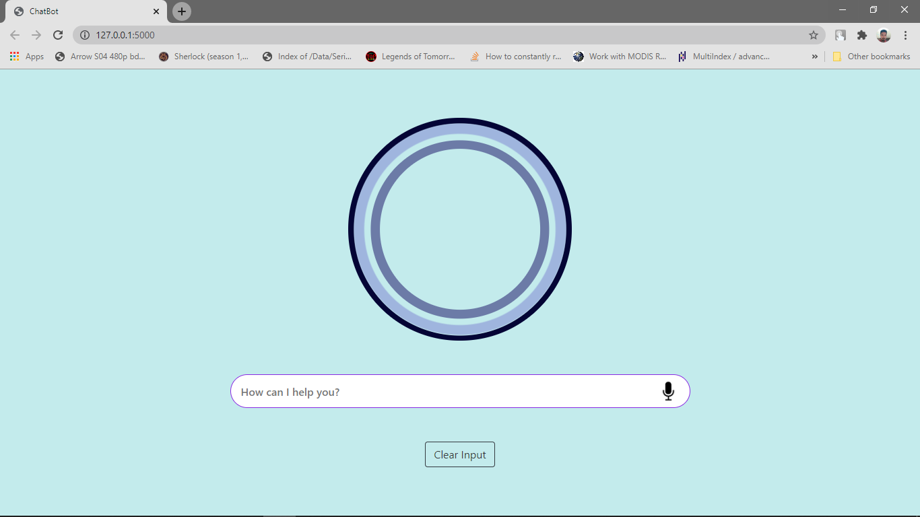

# ChatBot
This repo contains a simple chatbot implementation that can generate meaningfull texts against a question. This chatbot is implemented using `Tensorflow==0.12.1`. 

This model is trained on [Twitter data](https://raw.githubusercontent.com/Marsan-Ma/chat_corpus/master/twitter_en.txt.gz)

I also implemented weather report of any location. 

Inspired from [Udemy NLP](https://www.udemy.com/share/101X0WBEsZeF9bQHo=/)

The performance of that model is quiet good as it give relevant answers to most of the questions. 

## Some Examples

    How are you?
    - have been a nice day.
    Where do you live?
    -in a city.
    what is the weather in kolkata?
    - Currently kolkata is Mist and temperature is 21 degree C

